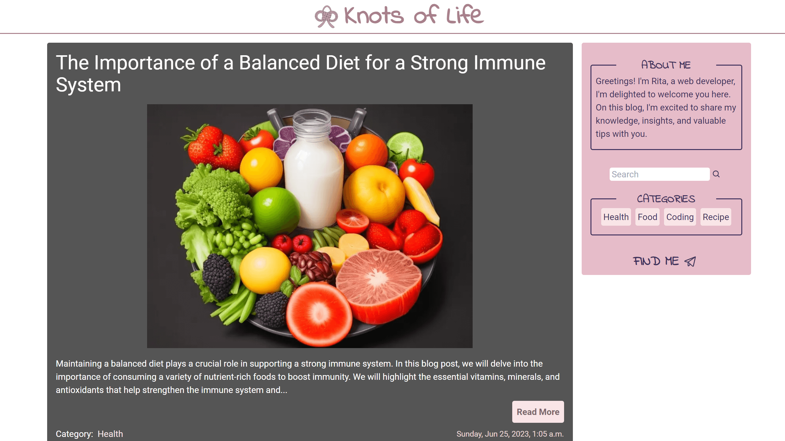

# Knots of Life

Knots of Life is a blog spot built with React that loads blog posts sourced from Sanity.io. The application offers several features to enhance the user experience and provide easy access to the content.

- [Live Demo Here](https://react-blog-nine-azure.vercel.app/)

## Features

- Browse the latest blog posts list in a paginated manner
- Search feature enables users to search for specific blog posts using keywords, allowing quick and targeted access to relevant content.
- Filter blog posts with category, enabling a more focused browsing experience
- Related posts are displayed for each blog post, allowing users to discover more content that aligns with their interests.

## Built with

- HTML
- Tailwind CSS
- React
- Typescript
- Sanity.io
